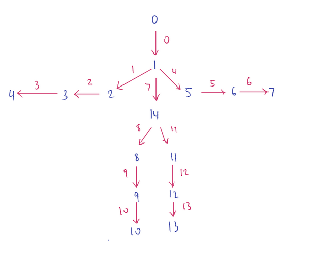

## Getting Familiar

To try the model out and get familiar with the end-to-end algorithm, I recommend going
through the original python demo notebook which can be found at `testing/python/demo.ipynb`.
This notebook will allow you to get familiar with the inputs and outputs of the neural network,
as well as the matching algorithm used in post-processing to establish pose models.

Note that you can configure the behaviour of the algorithm with the configuration file found
at `testing/python/config`. The main parameters you'll want to look out for are

* **use_gpu **, toggles caffe GPU/CPU mode
* **caffemodel, deployFile**, change these to load in the desired model

The original project comes with two pre-trained models: one trained on the COCO dataset and one
trained on the MPII dataset. The COCO dataset uses different pose keypoints than MPII. Our hockey
keypoints extend the MPII pose keypoints, so the pretrained MPII model will be used as a starting
point for training later on.

## Pose Model Specification - MPII

The pose keypoints indices for MPII are defined as follows in the algorithm:

*  0 - head top
*  1 - upper neck
*  2 - r shoulder
*  3 - r elbow
*  4 - r wrist
*  5 - l shoulder
*  6 - l elbow
*  7 - l wrist)
*  8 - r hip
*  9 - r knee
* 10 - r ankle
* 11 - l hip
* 12 - l knee
* 13 - l ankle
* 14 - midpoint between pelvis and thorax

<p align="center">

</p>

The red arrows represent limbs. So limb 2 would connect body part 2 (right shoulder) to
body part 3 (right elbow).

Also note that the original MPII pose keypoints consider the pelvis and thorax separately. So to make
MPII annotations compatible with a model trained with the above keypoint definitions, the pelvis and
thorax keypoints will have to be combined into a single keypoint.

## Algorithm Interface

For convenience, I've also wrapped the functionality described in `testing/python/demo.ipynb` into an
`OpenPosePredictor` class in `testing/python/predictor.py`. The class takes in an input image, passes into the
neural network, performs the graph matching on the network output, and returns a list of `PoseModel`
classes also described in `testing/python/predictor.py`. An usage example can be found at
`wrapper_test.ipynb`.

`OpenPosePredictor` and `PoseModel` can be configured with the same config file format as `testing/python/demo.ipynb`.
I've designed the two classes so that they can be configured to work with
any pose keypoint specification (i.e. can work with both COCO and MPII pose model outputs, and eventually
with the hockey pose models that has the two additional keypoints). To switch to a new pose model specification, simply
alter the following fields in the config file:

* **np**, the number of body parts in the pose model
* **limb_from**, the body part that each limb leaves from
* **limb_to**, the body part that each limb leaves to
* **limb_order**, the order in which to process limbs in the graph matching portion of the algorithm

The **limb_order** field is especially important to ensuring that the algorithm works correctly. Viewing the pose model
as a directed tree, I've streamlined the graph matching process under the assumption that the pose models are built in a
breadth first manner. 

So if you had a pose model that consisted of 4 body parts (indices 0-3) with the following limb definitions:

* limb 0 connects body part 0 to body part 1
* limb 1 connects body part 1 to body part 2
* limb 2 connects body part 2 to body part 3

When building the pose model, we would want to construct limb 0 first, then limb 1, then limb 2 to achieve a breadth
first traversal of the pose model tree. An example of an order that would not work would be 2, 1, 0.

The config file would define the following fields:

```
np = 4
limb_from = 0, 1, 1
limb_to = 1, 2, 3
limb_order = 0, 1, 2
```
## PCKh Calculation

[PCKh](http://human-pose.mpi-inf.mpg.de/#results) is the metric that we use to score the model. Essentially, it looks at
the *P*robability that the model detects a *C*orrect *K*eypoint. A detected keypoint is considered correct if it
deviates from the ground truth keypoint no more than 50% of the *h*ead segment length (calculated using ground truth
coordinates).

I've implemented a function `computePCKh` in `testing/python/predictor.py` which will determine which detected keypoints
are correct between a detected pose model and a ground truth pose model.

An example PCKh calculation can be found in the python notebook at `PCKh.ipynb`.

The script `test/python/computePCKh.py` runs through all the hockey images and records for each image:

* for each body part, 1 for correct, 0 for incorrect, and `np.nan` for not detected
* the total number of found body parts in the image
* the number of correct body parts found

Note that only the detected pose model with the highest number of detected body parts is used for comparison. The
results are stored in a pandas table and written to a csv at `testing/python/pckhrecord.csv` every 5 images. If the
file already exists, running the script will start from the last recorded image in `pckhrecord.csv`.

Once all the images can be processed, `pckhrecord.csv` can be loaded and the PCKh for each body part as well as the
overall PCKh can be calculated.

## Neural Network Training


